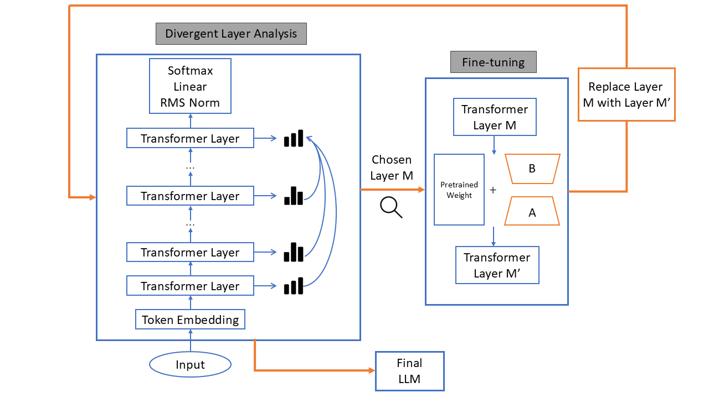

# LCHM-Layer-Contrast-Fine-tuning-for-Hallucination-Mitigation-in-LLMs
LCHM: layer-wise JSD selects a divergence-sensitive layer for single-layer LoRA fine-tuning to reduce LLM hallucinations; evaluated via log-probability gap on HaluEval.

